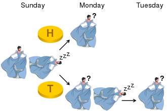

# Sleeping-Beauty-Problem
The Sleeping Beauty problem, also known as the Sleeping Beauty paradox, is a puzzle in decision theory in which an ideally rational epistemic agent is told they will be awoken from sleep either once or twice according to the toss of a coin. Each time they will have no memory of whether they have been awoken before, and are asked what their degree of belief that the outcome of the coin toss is Heads ought to be when they are first awakened.

The sleeping beauty is put to sleep on Sunday. That night a coin is tossed: if it's tails she's woken the next day (Monday), if it's heads, she's woken on Monday, but then is put to sleep and is woken the next day (Tuesday) as well. She immediately forgets about the previous wakings when she falls asleep.

The question goes like this: Upon being awakened, she is asked to guess the probability that heads came up on the last tossing. If you were in her shoes, what would your reply be?

Image Source: [Wikipedia/Sleeping Beauty problem](https://en.wikipedia.org/wiki/Sleeping_Beauty_problem))

